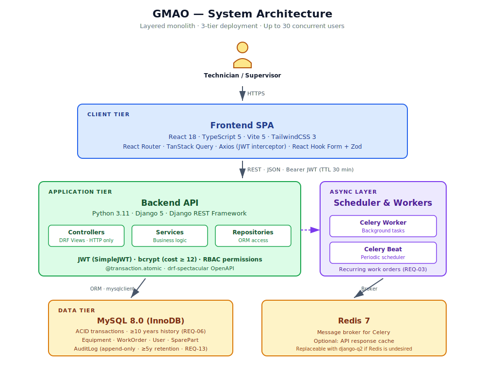
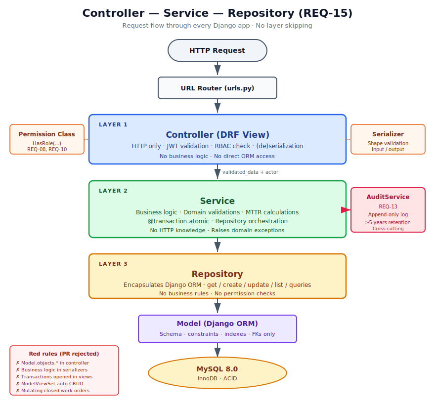

<div align="center">

# GMAO — Computerized Maintenance Management System

**A web-based platform to manage preventive and corrective maintenance of industrial equipment.**

[](https://www.python.org/)
[](https://www.djangoproject.com/)
[](https://www.django-rest-framework.org/)
[](https://react.dev/)
[](https://www.typescriptlang.org/)
[](https://vitejs.dev/)
[](https://tailwindcss.com/)
[](https://www.mysql.com/)
[](https://docs.celeryq.dev/)
[](https://github.com/psf/black)
[](#license)

</div>

---

## Table of Contents

- [Overview](#overview)
- [Key Features](#key-features)
- [Architecture](#architecture)
- [Tech Stack](#tech-stack)
- [Project Structure](#project-structure)
- [Domain Model](#domain-model)
- [Roles &amp; Permissions](#roles--permissions)
- [Quality Goals](#quality-goals)
- [Getting Started](#getting-started)
- [Available Scripts](#available-scripts)
- [Testing](#testing)
- [CI/CD](#cicd)
- [Code Conventions](#code-conventions)
- [Requirements Traceability](#requirements-traceability)
- [Contributing](#contributing)
- [Authors](#authors)
- [License](#license)

---

## Overview

**GMAO** (from the Spanish *Gestión de Mantenimiento Asistido por Ordenador*) is a maintenance management web application targeted at medium-sized industrial plants. It centralizes the equipment registry, the lifecycle of preventive and corrective work orders, the spare-parts inventory, and an immutable audit trail used for compliance and traceability.

The system was designed and built as part of a **Software Quality** course, taking quality attributes (security, reliability, performance, maintainability) and architectural decisions seriously rather than as an afterthought. Every functional requirement (REQ-01 to REQ-15) is mapped to a concrete module and to a test case.

### Design constraints

- **Up to 30 concurrent users** with sub-2 s P95 response time.
- **Two roles only**: `TECNICO` and `SUPERVISOR`, enforced by JWT-embedded claims and a defense-in-depth permission model.
- **Closed work orders are immutable** — the system rejects any write attempt and audits the denied operation.
- **Audit log is append-only** at the application and (recommended) database level, with a retention of at least 5 years.
- **All multi-table writes are ACID** via `@transaction.atomic` over MySQL InnoDB.

> 📚 The single source of truth for architecture and domain rules is [`GMAO.md`](./GMAO.md) (also referred to as `CLAUDE.md` in the repo). Any contributor — human or AI — must read it before writing code. The PDFs in [`/docs`](./docs/) (`REQUISITOS_GMAO.pdf` and `GMAO_Arquitectura_Calidad.pdf`) contain the formal requirements and the ATAM-style architecture analysis.

---

## Key Features

- 🔐 **Authentication & RBAC** — JWT (30 min TTL), bcrypt-hashed passwords (cost ≥ 12), role-based access on every protected endpoint.
- 🛠️ **Equipment registry** — Equipment is identified by an immutable business ID; only supervisors can create or modify entries.
- 📋 **Work-order lifecycle** — Preventive (scheduled) and corrective (incident-driven) flows with statuses `PROGRAMADO → EN_PROCESO → CERRADA`.
- ♻️ **Recurring orders** — When a periodic preventive order closes, the next one is generated automatically by a Celery task.
- 📦 **Spare-parts inventory** — Stock is decremented atomically as part of a corrective order's closing transaction.
- 📈 **Supervision dashboard** — Real-time overview of open orders, technicians' load, and MTTR per equipment. Polling-based, ≤ 5 s freshness.
- 📊 **Reporting** — Monthly MTTR reports and failure-frequency analytics, exportable to PDF.
- 📜 **Immutable audit trail** — Every critical operation (and every denied attempt) is logged to an append-only table with at least 5 years of retention.
- 🧪 **High test coverage** — ≥ 70 % unit-test coverage on the backend, enforced in CI.
- 📄 **OpenAPI documentation** — ≥ 80 % of endpoints documented via `drf-spectacular`.

---

## Architecture

The system is a **layered monolith** deployed across three tiers (client, application, data) and structured internally with a strict **Controller–Service–Repository (CSR)** pattern.

### System Architecture (3-tier)

The frontend is a single-page React application that talks to a Django REST API over HTTPS using JWT bearer tokens. The API persists data in MySQL and offloads scheduled jobs (recurring work orders, REQ-03) to a Celery worker that uses Redis as its message broker.



| Tier | Components | Notes |
|------|------------|-------|
| **Client** | React 18 + TypeScript + Vite, TailwindCSS, React Router, TanStack Query, Axios, RHF + Zod | Feature-based folder structure. No business logic — only UI orchestration and shape validation. |
| **Application** | Django 5 + DRF, SimpleJWT, Celery Worker, Celery Beat | Stateless API; horizontal scaling possible behind a reverse proxy. |
| **Data** | MySQL 8.0 (InnoDB), Redis 7 | InnoDB enforces ACID and FK integrity; the `AuditLog` table is append-only. |

### Layered Architecture (CSR pattern)

Inside every Django app, requests flow through three explicit layers. Skipping a layer (e.g. calling `Model.objects.*` from a view) is a hard architectural violation and a PR-rejection criterion.



| Layer | Responsibility | Forbidden |
|-------|----------------|-----------|
| **Controller** (DRF view) | Handle HTTP, validate JWT and RBAC, (de)serialize, delegate to a service | Direct ORM access · Business rules · Opening transactions |
| **Service** | All business logic, domain validations, calculations (e.g. MTTR), repository orchestration, transactions (`@transaction.atomic`) | HTTP awareness · Knowing about request/response/serializers |
| **Repository** | Encapsulate the ORM (`get`, `create`, `update`, `list`, complex queries) | Business rules · Permission checks |
| **Model** | Schema, constraints, indexes, foreign keys | Complex logic (belongs in services) |

**Cross-cutting concern:** the `AuditService` is invoked from services (never from controllers) and writes append-only entries to the `AuditLog` table to satisfy REQ-13.

---

## Tech Stack

### Backend

| Concern | Technology |
|---------|------------|
| Language &amp; framework | Python 3.11+ · Django 5 · Django REST Framework 3.15+ |
| Authentication | `djangorestframework-simplejwt` (JWT, 30 min TTL) |
| Password hashing | `bcrypt` (cost factor ≥ 12) |
| Database | MySQL 8.0 (InnoDB) via `mysqlclient` |
| Async &amp; scheduling | Celery 5 + Redis 7 *(or `django-q2` as a Redis-free alternative)* |
| API docs | `drf-spectacular` (OpenAPI 3) |
| Testing | `pytest` + `pytest-django` + `factory-boy` + `coverage` |
| Lint &amp; format | `ruff` + `black` |

### Frontend

| Concern | Technology |
|---------|------------|
| Language &amp; build | TypeScript 5 · Vite 5 |
| UI library | React 18 |
| Styling | TailwindCSS 3 |
| Routing | React Router 6 |
| Server state | TanStack Query 5 |
| Client state | Zustand *(only when needed for non-server state)* |
| HTTP client | Axios *(with a JWT interceptor)* |
| Forms | React Hook Form + Zod |
| Testing | Vitest + React Testing Library + MSW |
| Lint &amp; format | ESLint (typescript-eslint) + Prettier |

### DevOps

| Concern | Technology |
|---------|------------|
| CI | GitHub Actions (`backend-ci.yml`, `frontend-ci.yml`) |
| Local dev | Optional `docker-compose` (MySQL + Redis) |
| Load testing | Locust *(staging only, out of CI)* |

---

## Project Structure

The repository is a **monorepo** with the backend and the frontend as sibling folders.

```
gmao/
├── README.md                    # This file
├── GMAO.md                      # Architecture & domain rules (source of truth)
├── docker-compose.yml           # Optional dev environment (MySQL + Redis)
├── .github/workflows/           # CI pipelines
│   ├── backend-ci.yml
│   └── frontend-ci.yml
├── docs/
│   ├── images/                  # Architecture diagrams (SVG)
│   ├── REQUISITOS_GMAO.pdf      # Formal functional requirements
│   └── GMAO_Arquitectura_Calidad.pdf  # Quality attributes & ATAM scenarios
├── backend/
│   ├── manage.py
│   ├── pyproject.toml
│   ├── requirements.txt
│   ├── requirements-dev.txt
│   ├── gmao/                    # Django project config
│   │   ├── settings/{base,dev,prod}.py
│   │   ├── urls.py
│   │   └── wsgi.py / asgi.py
│   └── apps/
│       ├── authentication/      # Login, JWT, RBAC middleware
│       ├── users/               # User management (REQ-07)
│       ├── equipment/           # Equipment registry (REQ-01)
│       ├── work_orders/         # Work-order lifecycle (REQ-02..06)
│       ├── inventory/           # Spare parts
│       ├── audit/               # Immutable audit log (REQ-13)
│       └── reports/             # MTTR, dashboard (REQ-09, REQ-11)
└── frontend/
    ├── package.json
    ├── vite.config.ts
    └── src/
        ├── api/                 # Axios instance + endpoints per resource
        ├── components/ui/       # Generic reusable components
        ├── features/            # Feature-based modules
        │   ├── auth/
        │   ├── equipment/
        │   ├── work-orders/
        │   ├── dashboard/
        │   ├── reports/
        │   └── users/
        ├── hooks/
        ├── layouts/
        ├── pages/
        ├── router/
        ├── types/               # Shared types (mirrored from DRF serializers)
        └── utils/
```

### Per-app structure (CSR pattern, mandatory)

Every Django app under `backend/apps/` follows the same layout:

```
<app_name>/
├── models.py               # ORM schema only — no business logic
├── serializers.py          # DRF serializers (shape validation)
├── urls.py                 # Routes → controllers
├── controllers/            # DRF views — HTTP handling only
├── services/               # Business logic lives here
├── repositories/           # ORM access encapsulation
├── exceptions.py           # Domain-specific exceptions
└── tests/
    ├── test_services.py
    ├── test_controllers.py
    └── test_repositories.py
```

---

## Domain Model

| Entity | PK | Notes |
|--------|----|-------|
| `Equipment` | `id_unico` *(varchar, immutable)* | Business identifier set on creation; PATCH/PUT trying to change it returns `400`. |
| `WorkOrder` | `id_orden` *(autoinc)* | `tipo ∈ {PREVENTIVO, CORRECTIVO}`, `estado ∈ {PROGRAMADO, EN_PROCESO, CERRADA}`. Closed orders are immutable. |
| `User` | `id` *(autoinc)* | Custom user extending Django's `AbstractBaseUser`. `rol ∈ {TECNICO, SUPERVISOR}`. |
| `SparePart` | `id_repuesto` *(autoinc)* | Stock decremented atomically when a corrective order closes. |
| `WorkOrderSparePart` | composite | Join table with `cantidad_usada`. |
| `AuditLog` | `id_log` *(autoinc)* | Append-only at app and DB level. Retained ≥ 5 years. |

**Key DB constraints:** unique `Equipment.id_unico`, unique `User.username`, composite index `WorkOrder(fk_equipo, fecha_inicio DESC)` for history queries (REQ-06), index `AuditLog(timestamp, entidad_afectada)`.

---

## Roles &amp; Permissions

Permissions are checked twice (defense in depth): once in the DRF permission class on the controller, and again inside the service for domain-level operations. Role claims are embedded in the JWT to avoid per-request DB hits.

| Action | TECNICO | SUPERVISOR |
|--------|:-------:|:----------:|
| Log in | ✅ | ✅ |
| List / view equipment | ✅ | ✅ |
| Create / edit / delete equipment | ❌ | ✅ |
| Schedule preventive maintenance | ❌ | ✅ |
| Report a corrective failure | ✅ | ✅ |
| View own assigned orders | ✅ | ✅ |
| View all orders | ❌ | ✅ |
| Close own order | ✅ | ✅ |
| Modify a `CERRADA` order | ❌ | ❌ |
| View equipment history | ✅ | ✅ |
| Manage users | ❌ | ✅ |
| Access supervision dashboard | ❌ | ✅ |
| Generate monthly MTTR report | ❌ | ✅ |

---

## Quality Goals

The following targets must be met for any feature to be considered *done*. They map directly to the ISO/IEC 25010 quality attributes covered in `GMAO_Arquitectura_Calidad.pdf`.

| Quality attribute | Target | How it is verified |
|-------------------|--------|--------------------|
| Endpoint protection | 100 % (except `/auth/login`) | Automated test that walks `urls.py` |
| bcrypt cost factor | ≥ 12 | Hash inspection test |
| JWT TTL | 30 minutes | Config + expiration test |
| Transactional integrity | 100 % rollback on failure | Fault-injection test |
| Closed-order immutability | 100 % blocked | PATCH attempt against `CERRADA` order |
| P95 response time | ≤ 2000 ms with 30 concurrent users | Locust on staging |
| Dashboard freshness | ≤ 5 s after order closure | E2E test |
| Backend unit-test coverage | ≥ 70 % | `pytest --cov` in CI |
| Endpoint documentation | ≥ 80 % | `drf-spectacular` schema check |

---

## Getting Started

### Prerequisites

- Python **3.11+**
- Node.js **20+**
- MySQL **8.0+** (locally or via Docker)
- Redis **7+** (only if Celery is used)

### Backend setup

```bash
cd backend
python -m venv .venv
source .venv/bin/activate           # Windows: .venv\Scripts\activate
pip install -r requirements-dev.txt
cp .env.example .env                # Edit DB_*, JWT_SECRET, etc.
python manage.py migrate
python manage.py createsuperuser
python manage.py runserver 0.0.0.0:8000
```

### Frontend setup

```bash
cd frontend
npm install
cp .env.example .env                # VITE_API_URL=http://localhost:8000/api
npm run dev                         # http://localhost:5173
```

### Celery (optional — only if Celery is used as scheduler)

```bash
cd backend
celery -A gmao worker -l info
celery -A gmao beat -l info
```

### Quick smoke test

After both servers are running, open `http://localhost:5173`, log in with the superuser created above, and you should land on the dashboard.

---

## Available Scripts

### Backend

| Command | Purpose |
|---------|---------|
| `python manage.py runserver` | Run the dev server |
| `python manage.py makemigrations` | Generate migrations |
| `python manage.py migrate` | Apply migrations |
| `python manage.py seed` | Populate the DB with sample data |
| `pytest` | Run the test suite |
| `pytest --cov=apps --cov-report=term-missing` | Run tests with coverage |
| `ruff check .` | Lint |
| `black .` | Format |

### Frontend

| Command | Purpose |
|---------|---------|
| `npm run dev` | Dev server with HMR |
| `npm run build` | Production build |
| `npm run preview` | Preview the production build |
| `npm run test` | Run Vitest |
| `npm run test:coverage` | Run tests with coverage |
| `npm run lint` | ESLint |
| `npm run typecheck` | `tsc --noEmit` |

---

## Testing

### Backend (pytest)

Tests are organized **per layer** to mirror the CSR architecture:

- `test_services.py` — pure business-logic tests, mocking the repositories.
- `test_repositories.py` — run against a real test database (SQLite in-memory or a MySQL test DB).
- `test_controllers.py` — use DRF's `APIClient`, mocking services if needed.

`factory-boy` provides model fixtures.

**Mandatory scenarios** (from the architecture document):

| ID | Scenario |
|----|----------|
| EQ-01 | Technician POSTs to a supervisor-only endpoint → `403` + audit log entry |
| EQ-02 | Expired token → `401` |
| EQ-03 | Multi-table write fails mid-transaction → full rollback, no residue |
| EQ-04 | PATCH on a `CERRADA` order → `422` |
| EQ-05 | Load test (Locust, run outside CI) |
| EQ-07 | Regression test when adding a new module |

### Frontend (Vitest + RTL)

- Component tests for critical flows (work-order closing form, dashboard).
- Custom-hook tests (auth, permissions).
- Integration tests with **MSW** to mock the API.

---

## CI/CD

Two GitHub Actions workflows guard the `main` branch — **no merge without a green build**.

### `backend-ci.yml`
1. Set up Python 3.11.
2. Install `requirements-dev.txt`.
3. `ruff check .` (lint).
4. `black --check .` (format).
5. `pytest --cov=apps --cov-fail-under=70`.
6. *(Optional)* upload coverage to Codecov.

### `frontend-ci.yml`
1. Set up Node 20.
2. `npm ci`.
3. `npm run lint`.
4. `npm run typecheck`.
5. `npm run test -- --coverage`.
6. `npm run build` (smoke test).

---

## Code Conventions

### Backend (Python)

- **Format:** Black (line length 100).
- **Lint:** Ruff (configured in `pyproject.toml`).
- **Type hints are mandatory** in services and repositories.
- **Docstrings:** Google style for public functions.
- Naming: `snake_case` for functions/variables, `PascalCase` for classes.

### Frontend (TypeScript)

- **Format:** Prettier (config in `frontend/.prettierrc`).
- **Lint:** ESLint with `typescript-eslint` recommended.
- **`any` is forbidden** unless justified inline with a comment.
- Components: `PascalCase.tsx`. Hooks: `useCamelCase.ts`.
- Shared API types live in `frontend/src/types/api.ts`, ideally generated from the OpenAPI schema produced by `drf-spectacular`.

### Git

- **Branches:** `main` (protected) · `develop` · `feature/<req-id>-description` · `fix/<description>`.
- **Commits** follow [Conventional Commits](https://www.conventionalcommits.org/):
  - `feat(work-orders): implement order closing (REQ-05)`
  - `fix(audit): correct timezone in timestamp`
  - `test(equipment): add duplicate-ID test`
- **Pull requests:** title = main commit; description states *what*, *why*, REQ-IDs covered, and *how it was tested*.

---

## Requirements Traceability

Every functional requirement maps to a specific module and test suite.

| REQ | Module | Notes |
|-----|--------|-------|
| REQ-01 | `apps/equipment` | Immutable `id_unico`, validated in service |
| REQ-02 | `apps/work_orders` | Date validation + supervisor RBAC |
| REQ-03 | `apps/work_orders` + Celery task `generate_recurring_orders` | Auto-generates the next preventive order |
| REQ-04 | `apps/work_orders` | Corrective-order registration flow |
| REQ-05 | `apps/work_orders` | Closed-order immutability guard |
| REQ-06 | `apps/work_orders` (history endpoint) | Composite index `(fk_equipo, fecha_inicio DESC)` |
| REQ-07 | `apps/users` | Supervisor-only management |
| REQ-08 | `apps/authentication` | JWT 30 min + bcrypt |
| REQ-09 | `apps/reports` | MTTR calculation + PDF export |
| REQ-10 | `apps/authentication/permissions.py` | `HasRole(...)` permission class |
| REQ-11 | `apps/reports` (dashboard) + `apps/users` | Supervisor dashboard |
| REQ-12 | Cross-cutting — `@transaction.atomic` in services | Backed by InnoDB |
| REQ-13 | `apps/audit` | Append-only table |
| REQ-14 | Configuration + load tests | Indexes, connection pool |
| REQ-15 | Folder structure + `drf-spectacular` | 80 % of endpoints documented |

---

## Contributing

This is an academic project with two main authors, but contributions or suggestions through issues and PRs are welcome.

Before opening a PR:

1. Read [`GMAO.md`](./GMAO.md) — it is the architectural source of truth.
2. Map your change to one or more REQ-IDs (or open an issue if it does not).
3. Respect the layer separation: a new endpoint means three files (controller, service, repository) and at least one test per layer.
4. Make sure CI is green (lint, types, tests, coverage).
5. Use Conventional Commits.

If a suggestion contradicts the architecture rules described in `GMAO.md`, the document wins.

---

## Authors

- **Miguel Ángel Escobar Montoya**
- **Simón Valderrama Mesa**

**Institution:** Institución Universitaria de Envigado — Computer Engineering
**Course:** Software Quality (instructor: *Martha Ligia Murillo Díaz*)
**Year:** 2026

---

## License

This project is developed as academic coursework. Code may be reviewed for educational purposes; please contact the authors for any other use.
