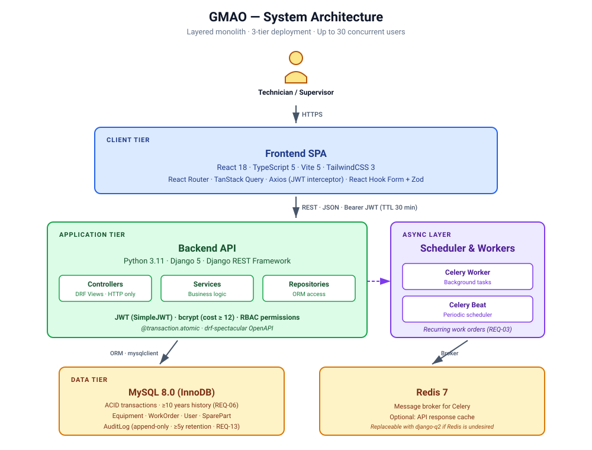
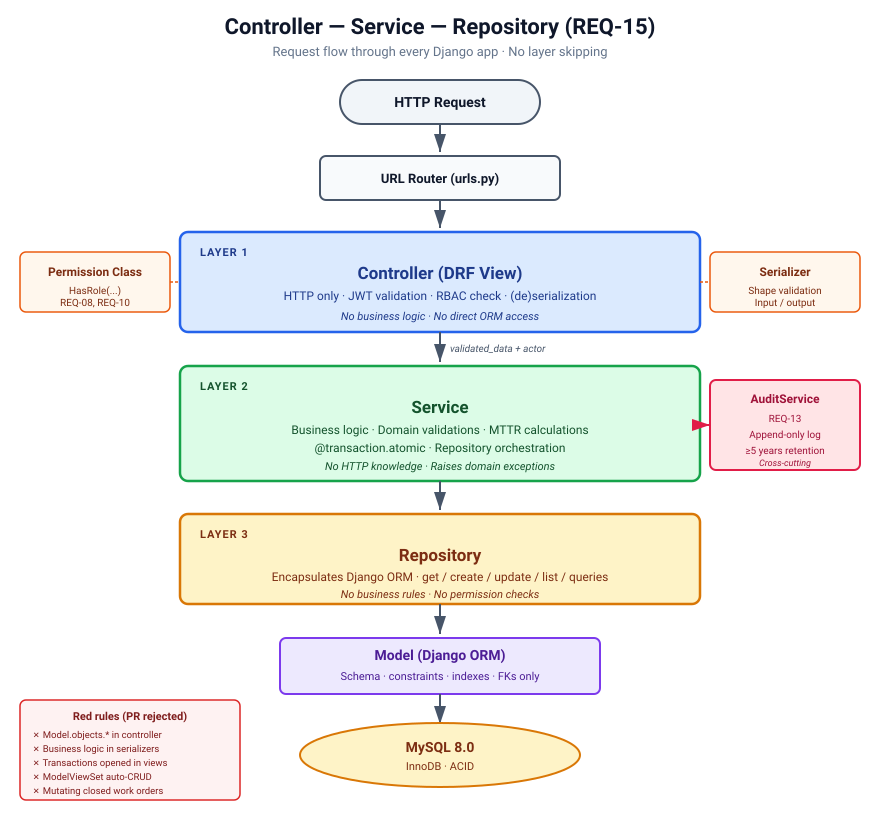

<div align="center">

# GMAO — Sistema de Gestión de Mantenimiento Asistido por Ordenador

**Plataforma web para gestionar el mantenimiento preventivo y correctivo de equipos industriales.**

[](https://www.python.org/)
[](https://www.djangoproject.com/)
[](https://www.django-rest-framework.org/)
[](https://react.dev/)
[](https://www.typescriptlang.org/)
[](https://vitejs.dev/)
[](https://tailwindcss.com/)
[](https://www.mysql.com/)
[](https://docs.celeryq.dev/)
[](https://github.com/psf/black)
[](#licencia)

</div>

---

## Tabla de Contenidos

- [Descripción General](#descripción-general)
- [Características Principales](#características-principales)
- [Arquitectura](#arquitectura)
- [Stack Tecnológico](#stack-tecnológico)
- [Estructura del Proyecto](#estructura-del-proyecto)
- [Modelo de Dominio](#modelo-de-dominio)
- [Roles y Permisos](#roles-y-permisos)
- [Objetivos de Calidad](#objetivos-de-calidad)
- [Primeros Pasos](#primeros-pasos)
- [Scripts Disponibles](#scripts-disponibles)
- [Pruebas](#pruebas)
- [CI/CD](#cicd)
- [Convenciones de Código](#convenciones-de-código)
- [Trazabilidad de Requisitos](#trazabilidad-de-requisitos)
- [Contribuciones](#contribuciones)
- [Autores](#autores)
- [Licencia](#licencia)

---

## Descripción General

**GMAO** (Gestión de Mantenimiento Asistido por Ordenador) es una aplicación web de gestión de mantenimiento dirigida a plantas industriales medianas. Centraliza el registro de equipos, el ciclo de vida de las órdenes de trabajo preventivas y correctivas, el inventario de repuestos y un registro de auditoría inmutable utilizado para cumplimiento normativo y trazabilidad.

El sistema fue diseñado y construido como parte de un curso de **Calidad de Software**, tomando en serio los atributos de calidad (seguridad, fiabilidad, rendimiento, mantenibilidad) y las decisiones arquitectónicas, en lugar de tratarlos como algo secundario. Cada requisito funcional (REQ-01 a REQ-15) está mapeado a un módulo concreto y a un caso de prueba.

### Restricciones de diseño

- **Hasta 30 usuarios concurrentes** con tiempo de respuesta P95 inferior a 2 s.
- **Solo dos roles**: `TECNICO` y `SUPERVISOR`, aplicados mediante claims embebidos en JWT y un modelo de permisos con defensa en profundidad.
- **Las órdenes de trabajo cerradas son inmutables** — el sistema rechaza cualquier intento de escritura y registra la operación denegada en auditoría.
- **El registro de auditoría es de solo adición** a nivel de aplicación y (recomendado) de base de datos, con una retención mínima de 5 años.
- **Todas las escrituras multi-tabla son ACID** mediante `@transaction.atomic` sobre MySQL InnoDB.

> 📚 La fuente única de verdad para la arquitectura y las reglas de dominio es [`GMAO.md`](./GMAO.md) (también referenciado como `CLAUDE.md` en el repositorio). Cualquier colaborador — humano o IA — debe leerlo antes de escribir código. Los PDFs en [`/docs`](./docs/) (`REQUISITOS_GMAO.pdf` y `GMAO_Arquitectura_Calidad.pdf`) contienen los requisitos formales y el análisis de arquitectura al estilo ATAM.

---

## Características Principales

- 🔐 **Autenticación y RBAC** — JWT (TTL de 30 min), contraseñas hasheadas con bcrypt (coste ≥ 12), control de acceso por rol en cada endpoint protegido.
- 🛠️ **Registro de equipos** — Los equipos se identifican mediante un ID de negocio inmutable; solo los supervisores pueden crear o modificar entradas.
- 📋 **Ciclo de vida de órdenes de trabajo** — Flujos preventivos (programados) y correctivos (por incidente) con estados `PROGRAMADO → EN_PROCESO → CERRADA`.
- ♻️ **Órdenes recurrentes** — Cuando se cierra una orden preventiva periódica, la siguiente se genera automáticamente mediante una tarea de Celery.
- 📦 **Inventario de repuestos** — El stock se decrementa de forma atómica como parte de la transacción de cierre de una orden correctiva.
- 📈 **Panel de supervisión** — Vista en tiempo real de órdenes abiertas, carga de técnicos y MTTR por equipo. Basado en polling, con actualización ≤ 5 s.
- 📊 **Informes** — Informes mensuales de MTTR y análisis de frecuencia de fallos, exportables a PDF.
- 📜 **Registro de auditoría inmutable** — Cada operación crítica (y cada intento denegado) queda registrada en una tabla de solo adición con retención mínima de 5 años.
- 🧪 **Alta cobertura de pruebas** — ≥ 70 % de cobertura de pruebas unitarias en el backend, aplicado en CI.
- 📄 **Documentación OpenAPI** — ≥ 80 % de los endpoints documentados mediante `drf-spectacular`.

---

## Arquitectura

El sistema es un **monolito por capas** desplegado en tres niveles (cliente, aplicación, datos) y estructurado internamente con un estricto patrón **Controlador–Servicio–Repositorio (CSR)**.

### Arquitectura del Sistema (3 niveles)

El frontend es una aplicación React de página única que se comunica con una API REST de Django a través de HTTPS usando tokens JWT Bearer. La API persiste datos en MySQL y delega tareas programadas (órdenes recurrentes, REQ-03) a un worker de Celery que usa Redis como broker de mensajes.



| Nivel | Componentes | Notas |
|-------|------------|-------|
| **Cliente** | React 18 + TypeScript + Vite, TailwindCSS, React Router, TanStack Query, Axios, RHF + Zod | Estructura de carpetas por funcionalidad. Sin lógica de negocio — solo orquestación de UI y validación de forma. |
| **Aplicación** | Django 5 + DRF, SimpleJWT, Celery Worker, Celery Beat | API sin estado; escalado horizontal posible detrás de un proxy inverso. |
| **Datos** | MySQL 8.0 (InnoDB), Redis 7 | InnoDB garantiza ACID e integridad de FK; la tabla `AuditLog` es de solo adición. |

### Arquitectura por Capas (patrón CSR)

Dentro de cada aplicación Django, las peticiones fluyen a través de tres capas explícitas. Saltarse una capa (p. ej. llamar a `Model.objects.*` desde una vista) es una violación arquitectónica grave y criterio de rechazo de PR.



| Capa | Responsabilidad | Prohibido |
|------|----------------|-----------|
| **Controlador** (vista DRF) | Manejar HTTP, validar JWT y RBAC, (de)serializar, delegar al servicio | Acceso directo al ORM · Reglas de negocio · Abrir transacciones |
| **Servicio** | Toda la lógica de negocio, validaciones de dominio, cálculos (p. ej. MTTR), orquestación de repositorios, transacciones (`@transaction.atomic`) | Conocimiento de HTTP · Conocimiento de request/response/serializers |
| **Repositorio** | Encapsular el ORM (`get`, `create`, `update`, `list`, consultas complejas) | Reglas de negocio · Comprobaciones de permisos |
| **Modelo** | Esquema, restricciones, índices, claves foráneas | Lógica compleja (pertenece a los servicios) |

**Aspecto transversal:** el `AuditService` se invoca desde los servicios (nunca desde los controladores) y escribe entradas de solo adición en la tabla `AuditLog` para satisfacer el REQ-13.

---

## Stack Tecnológico

### Backend

| Área | Tecnología |
|---------|------------|
| Lenguaje y framework | Python 3.11+ · Django 5 · Django REST Framework 3.15+ |
| Autenticación | `djangorestframework-simplejwt` (JWT, TTL 30 min) |
| Hash de contraseñas | `bcrypt` (factor de coste ≥ 12) |
| Base de datos | MySQL 8.0 (InnoDB) mediante `mysqlclient` |
| Async y programación | Celery 5 + Redis 7 *(o `django-q2` como alternativa sin Redis)* |
| Documentación API | `drf-spectacular` (OpenAPI 3) |
| Pruebas | `pytest` + `pytest-django` + `factory-boy` + `coverage` |
| Lint y formato | `ruff` + `black` |

### Frontend

| Área | Tecnología |
|---------|------------|
| Lenguaje y compilación | TypeScript 5 · Vite 5 |
| Biblioteca UI | React 18 |
| Estilos | TailwindCSS 3 |
| Enrutamiento | React Router 6 |
| Estado del servidor | TanStack Query 5 |
| Estado del cliente | Zustand *(solo cuando sea necesario para estado no-servidor)* |
| Cliente HTTP | Axios *(con interceptor JWT)* |
| Formularios | React Hook Form + Zod |
| Pruebas | Vitest + React Testing Library + MSW |
| Lint y formato | ESLint (typescript-eslint) + Prettier |

### DevOps

| Área | Tecnología |
|---------|------------|
| CI | GitHub Actions (`backend-ci.yml`, `frontend-ci.yml`) |
| Entorno local | `docker-compose` opcional (MySQL + Redis) |
| Pruebas de carga | Locust *(solo en staging, fuera de CI)* |

---

## Estructura del Proyecto

El repositorio es un **monorepo** con el backend y el frontend como carpetas hermanas.

```
gmao/
├── README.md                    # Este archivo
├── GMAO.md                      # Reglas de arquitectura y dominio (fuente de verdad)
├── docker-compose.yml           # Entorno de desarrollo opcional (MySQL + Redis)
├── .github/workflows/           # Pipelines de CI
│   ├── backend-ci.yml
│   └── frontend-ci.yml
├── docs/
│   ├── images/                  # Diagramas de arquitectura (SVG)
│   ├── REQUISITOS_GMAO.pdf      # Requisitos funcionales formales
│   └── GMAO_Arquitectura_Calidad.pdf  # Atributos de calidad y escenarios ATAM
├── backend/
│   ├── manage.py
│   ├── pyproject.toml
│   ├── requirements.txt
│   ├── requirements-dev.txt
│   ├── gmao/                    # Configuración del proyecto Django
│   │   ├── settings/{base,dev,prod}.py
│   │   ├── urls.py
│   │   └── wsgi.py / asgi.py
│   └── apps/
│       ├── authentication/      # Login, JWT, middleware RBAC
│       ├── users/               # Gestión de usuarios (REQ-07)
│       ├── equipment/           # Registro de equipos (REQ-01)
│       ├── work_orders/         # Ciclo de vida de órdenes de trabajo (REQ-02..06)
│       ├── inventory/           # Repuestos
│       ├── audit/               # Registro de auditoría inmutable (REQ-13)
│       └── reports/             # MTTR, dashboard (REQ-09, REQ-11)
└── frontend/
    ├── package.json
    ├── vite.config.ts
    └── src/
        ├── api/                 # Instancia Axios + endpoints por recurso
        ├── components/ui/       # Componentes genéricos reutilizables
        ├── features/            # Módulos por funcionalidad
        │   ├── auth/
        │   ├── equipment/
        │   ├── work-orders/
        │   ├── dashboard/
        │   ├── reports/
        │   └── users/
        ├── hooks/
        ├── layouts/
        ├── pages/
        ├── router/
        ├── types/               # Tipos compartidos (espejo de los serializers de DRF)
        └── utils/
```

### Estructura por aplicación (patrón CSR, obligatorio)

Cada aplicación Django bajo `backend/apps/` sigue la misma estructura:

```
<nombre_app>/
├── models.py               # Solo esquema ORM — sin lógica de negocio
├── serializers.py          # Serializers DRF (validación de forma)
├── urls.py                 # Rutas → controladores
├── controllers/            # Vistas DRF — solo manejo HTTP
├── services/               # La lógica de negocio vive aquí
├── repositories/           # Encapsulación del acceso al ORM
├── exceptions.py           # Excepciones específicas del dominio
└── tests/
    ├── test_services.py
    ├── test_controllers.py
    └── test_repositories.py
```

---

## Modelo de Dominio

| Entidad | PK | Notas |
|--------|----|-------|
| `Equipment` | `id_unico` *(varchar, inmutable)* | Identificador de negocio establecido en la creación; PATCH/PUT que intente cambiarlo devuelve `400`. |
| `WorkOrder` | `id_orden` *(autoinc)* | `tipo ∈ {PREVENTIVO, CORRECTIVO}`, `estado ∈ {PROGRAMADO, EN_PROCESO, CERRADA}`. Las órdenes cerradas son inmutables. |
| `User` | `id` *(autoinc)* | Usuario personalizado que extiende `AbstractBaseUser` de Django. `rol ∈ {TECNICO, SUPERVISOR}`. |
| `SparePart` | `id_repuesto` *(autoinc)* | Stock decrementado atómicamente al cerrar una orden correctiva. |
| `WorkOrderSparePart` | compuesta | Tabla de unión con `cantidad_usada`. |
| `AuditLog` | `id_log` *(autoinc)* | Solo adición a nivel de app y BD. Retenido ≥ 5 años. |

**Restricciones clave en BD:** único `Equipment.id_unico`, único `User.username`, índice compuesto `WorkOrder(fk_equipo, fecha_inicio DESC)` para consultas de historial (REQ-06), índice `AuditLog(timestamp, entidad_afectada)`.

---

## Roles y Permisos

Los permisos se verifican dos veces (defensa en profundidad): una vez en la clase de permisos DRF del controlador, y otra dentro del servicio para operaciones a nivel de dominio. Los claims de rol se embeben en el JWT para evitar consultas a BD por cada petición.

| Acción | TECNICO | SUPERVISOR |
|--------|:-------:|:----------:|
| Iniciar sesión | ✅ | ✅ |
| Listar / ver equipos | ✅ | ✅ |
| Crear / editar / eliminar equipos | ❌ | ✅ |
| Programar mantenimiento preventivo | ❌ | ✅ |
| Reportar un fallo correctivo | ✅ | ✅ |
| Ver propias órdenes asignadas | ✅ | ✅ |
| Ver todas las órdenes | ❌ | ✅ |
| Cerrar orden propia | ✅ | ✅ |
| Modificar una orden `CERRADA` | ❌ | ❌ |
| Ver historial de equipo | ✅ | ✅ |
| Gestionar usuarios | ❌ | ✅ |
| Acceder al panel de supervisión | ❌ | ✅ |
| Generar informe mensual de MTTR | ❌ | ✅ |

---

## Objetivos de Calidad

Los siguientes objetivos deben cumplirse para que cualquier funcionalidad se considere *terminada*. Se mapean directamente a los atributos de calidad ISO/IEC 25010 cubiertos en `GMAO_Arquitectura_Calidad.pdf`.

| Atributo de calidad | Objetivo | Cómo se verifica |
|-------------------|--------|--------------------|
| Protección de endpoints | 100 % (excepto `/auth/login`) | Test automatizado que recorre `urls.py` |
| Factor de coste bcrypt | ≥ 12 | Test de inspección del hash |
| TTL del JWT | 30 minutos | Configuración + test de expiración |
| Integridad transaccional | 100 % de rollback ante fallo | Test de inyección de fallos |
| Inmutabilidad de orden cerrada | 100 % bloqueado | Intento de PATCH sobre orden `CERRADA` |
| Tiempo de respuesta P95 | ≤ 2000 ms con 30 usuarios concurrentes | Locust en staging |
| Actualización del dashboard | ≤ 5 s tras cierre de orden | Test E2E |
| Cobertura de pruebas unitarias backend | ≥ 70 % | `pytest --cov` en CI |
| Documentación de endpoints | ≥ 80 % | Comprobación de esquema `drf-spectacular` |

---

## Primeros Pasos

### Requisitos previos

- Python **3.11+**
- Node.js **20+**
- MySQL **8.0+** (local o vía Docker)
- Redis **7+** (solo si se usa Celery)

### Configuración del Backend

```bash
cd backend
python -m venv .venv
source .venv/bin/activate           # Windows: .venv\Scripts\activate
pip install -r requirements-dev.txt
cp .env.example .env                # Editar DB_*, JWT_SECRET, etc.
python manage.py migrate
python manage.py createsuperuser
python manage.py runserver 0.0.0.0:8000
```

### Configuración del Frontend

```bash
cd frontend
npm install
cp .env.example .env                # VITE_API_URL=http://localhost:8000/api
npm run dev                         # http://localhost:5173
```

### Celery (opcional — solo si se usa Celery como planificador)

```bash
cd backend
celery -A gmao worker -l info
celery -A gmao beat -l info
```

### Prueba de humo rápida

Una vez que ambos servidores estén en ejecución, abre `http://localhost:5173`, inicia sesión con el superusuario creado anteriormente y deberías llegar al panel de control.

---

## Scripts Disponibles

### Backend

| Comando | Propósito |
|---------|---------|
| `python manage.py runserver` | Ejecutar el servidor de desarrollo |
| `python manage.py makemigrations` | Generar migraciones |
| `python manage.py migrate` | Aplicar migraciones |
| `python manage.py seed` | Poblar la BD con datos de ejemplo |
| `pytest` | Ejecutar la suite de pruebas |
| `pytest --cov=apps --cov-report=term-missing` | Ejecutar pruebas con cobertura |
| `ruff check .` | Lint |
| `black .` | Formatear |

### Frontend

| Comando | Propósito |
|---------|---------|
| `npm run dev` | Servidor de desarrollo con HMR |
| `npm run build` | Compilación de producción |
| `npm run preview` | Previsualizar la compilación de producción |
| `npm run test` | Ejecutar Vitest |
| `npm run test:coverage` | Ejecutar pruebas con cobertura |
| `npm run lint` | ESLint |
| `npm run typecheck` | `tsc --noEmit` |

---

## Pruebas

### Backend (pytest)

Las pruebas están organizadas **por capa** para reflejar la arquitectura CSR:

- `test_services.py` — pruebas de lógica de negocio pura, con repositorios simulados (mock).
- `test_repositories.py` — se ejecutan contra una base de datos de prueba real (SQLite en memoria o una BD de prueba MySQL).
- `test_controllers.py` — usan el `APIClient` de DRF, simulando servicios si es necesario.

`factory-boy` proporciona fixtures de modelos.

**Escenarios obligatorios** (del documento de arquitectura):

| ID | Escenario |
|----|----------|
| EQ-01 | Técnico hace POST a un endpoint solo para supervisores → `403` + entrada en registro de auditoría |
| EQ-02 | Token expirado → `401` |
| EQ-03 | Escritura multi-tabla falla a mitad de transacción → rollback completo, sin residuos |
| EQ-04 | PATCH sobre una orden `CERRADA` → `422` |
| EQ-05 | Prueba de carga (Locust, fuera de CI) |
| EQ-07 | Prueba de regresión al añadir un nuevo módulo |

### Frontend (Vitest + RTL)

- Pruebas de componentes para flujos críticos (formulario de cierre de orden de trabajo, dashboard).
- Pruebas de hooks personalizados (autenticación, permisos).
- Pruebas de integración con **MSW** para simular la API.

---

## CI/CD

Dos flujos de trabajo de GitHub Actions protegen la rama `main` — **no hay merge sin una compilación en verde**.

### `backend-ci.yml`
1. Configurar Python 3.11.
2. Instalar `requirements-dev.txt`.
3. `ruff check .` (lint).
4. `black --check .` (formato).
5. `pytest --cov=apps --cov-fail-under=70`.
6. *(Opcional)* subir cobertura a Codecov.

### `frontend-ci.yml`
1. Configurar Node 20.
2. `npm ci`.
3. `npm run lint`.
4. `npm run typecheck`.
5. `npm run test -- --coverage`.
6. `npm run build` (prueba de humo).

---

## Convenciones de Código

### Backend (Python)

- **Formato:** Black (longitud de línea 100).
- **Lint:** Ruff (configurado en `pyproject.toml`).
- **Las anotaciones de tipo son obligatorias** en servicios y repositorios.
- **Docstrings:** estilo Google para funciones públicas.
- Nomenclatura: `snake_case` para funciones/variables, `PascalCase` para clases.

### Frontend (TypeScript)

- **Formato:** Prettier (configuración en `frontend/.prettierrc`).
- **Lint:** ESLint con `typescript-eslint` recomendado.
- **`any` está prohibido** salvo que esté justificado en línea con un comentario.
- Componentes: `PascalCase.tsx`. Hooks: `useCamelCase.ts`.
- Los tipos de API compartidos viven en `frontend/src/types/api.ts`, idealmente generados desde el esquema OpenAPI producido por `drf-spectacular`.

### Git

- **Ramas:** `main` (protegida) · `develop` · `feature/<req-id>-descripcion` · `fix/<descripcion>`.
- **Commits** siguen [Conventional Commits](https://www.conventionalcommits.org/):
  - `feat(work-orders): implement order closing (REQ-05)`
  - `fix(audit): correct timezone in timestamp`
  - `test(equipment): add duplicate-ID test`
- **Pull requests:** el título es el commit principal; la descripción indica *qué*, *por qué*, los REQ-IDs cubiertos y *cómo se probó*.

---

## Trazabilidad de Requisitos

Cada requisito funcional está mapeado a un módulo específico y a una suite de pruebas.

| REQ | Módulo | Notas |
|-----|--------|-------|
| REQ-01 | `apps/equipment` | `id_unico` inmutable, validado en el servicio |
| REQ-02 | `apps/work_orders` | Validación de fechas + RBAC de supervisor |
| REQ-03 | `apps/work_orders` + tarea Celery `generate_recurring_orders` | Genera automáticamente la siguiente orden preventiva |
| REQ-04 | `apps/work_orders` | Flujo de registro de orden correctiva |
| REQ-05 | `apps/work_orders` | Guardia de inmutabilidad de orden cerrada |
| REQ-06 | `apps/work_orders` (endpoint de historial) | Índice compuesto `(fk_equipo, fecha_inicio DESC)` |
| REQ-07 | `apps/users` | Gestión exclusiva para supervisores |
| REQ-08 | `apps/authentication` | JWT 30 min + bcrypt |
| REQ-09 | `apps/reports` | Cálculo de MTTR + exportación a PDF |
| REQ-10 | `apps/authentication/permissions.py` | Clase de permiso `HasRole(...)` |
| REQ-11 | `apps/reports` (dashboard) + `apps/users` | Panel de supervisión |
| REQ-12 | Transversal — `@transaction.atomic` en servicios | Respaldado por InnoDB |
| REQ-13 | `apps/audit` | Tabla de solo adición |
| REQ-14 | Configuración + pruebas de carga | Índices, pool de conexiones |
| REQ-15 | Estructura de carpetas + `drf-spectacular` | 80 % de endpoints documentados |

---

## Contribuciones

Este es un proyecto académico con dos autores principales, pero se aceptan contribuciones o sugerencias mediante issues y PRs.

Antes de abrir un PR:

1. Lee [`GMAO.md`](./GMAO.md) — es la fuente arquitectónica de verdad.
2. Mapea tu cambio a uno o más REQ-IDs (o abre un issue si no aplica).
3. Respeta la separación de capas: un nuevo endpoint implica tres archivos (controlador, servicio, repositorio) y al menos una prueba por capa.
4. Asegúrate de que el CI esté en verde (lint, tipos, pruebas, cobertura).
5. Usa Conventional Commits.

Si una sugerencia contradice las reglas de arquitectura descritas en `GMAO.md`, el documento tiene prioridad.

---

## Autores

- **Miguel Ángel Escobar Montoya**
- **Simón Valderrama Mesa**

**Institución:** Institución Universitaria de Envigado — Ingeniería de Sistemas  
**Curso:** Calidad de Software (docente: *Martha Ligia Murillo Díaz*)  
**Año:** 2026

---

## Licencia

Este proyecto fue desarrollado como trabajo académico. El código puede revisarse con fines educativos; contacte a los autores para cualquier otro uso.
